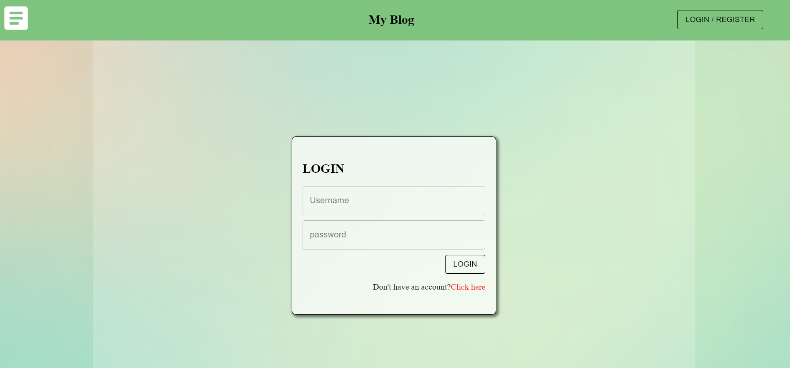
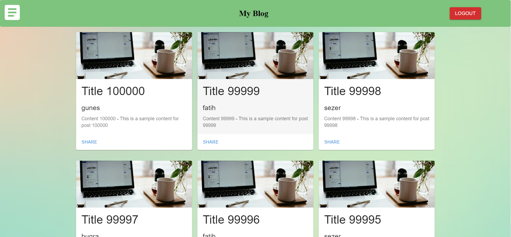
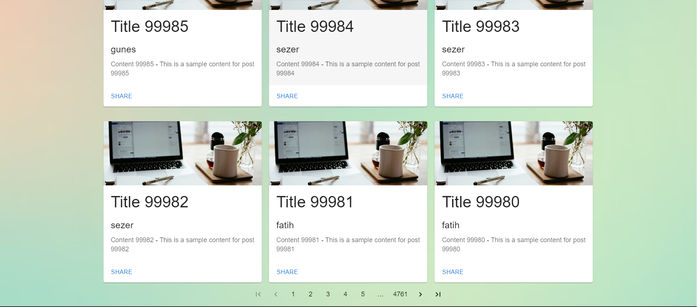

# Frontend for Personal Blog Site

This is the frontend of the Blog Site, developed using React and JavaScript. It provides an interactive user interface for user registration, login, blog post creation, and a commenting system, making it easy for users to share and engage with content.

## Features
## Features

- **User Registration and Login**: 
  - A form for new users to create an account.
  - A secure login page for existing users.

  

   

- **Blog Management**:
  - Users can create, edit, delete, and share their blog posts.
  - View all blog posts from various users.

  

  

  - **User Profile Management**: 
  Users can update their profile information.

- **Comment Feature**:
  - Users can add comments to blog posts.
  - Manage comments (e.g., edit or delete their own comments).

## Tech Stack

- **Programming Language**: JavaScript
- **Framework/Library**: React
- **Styling**: CSS / Styled Components
- **State Management**: Redux
